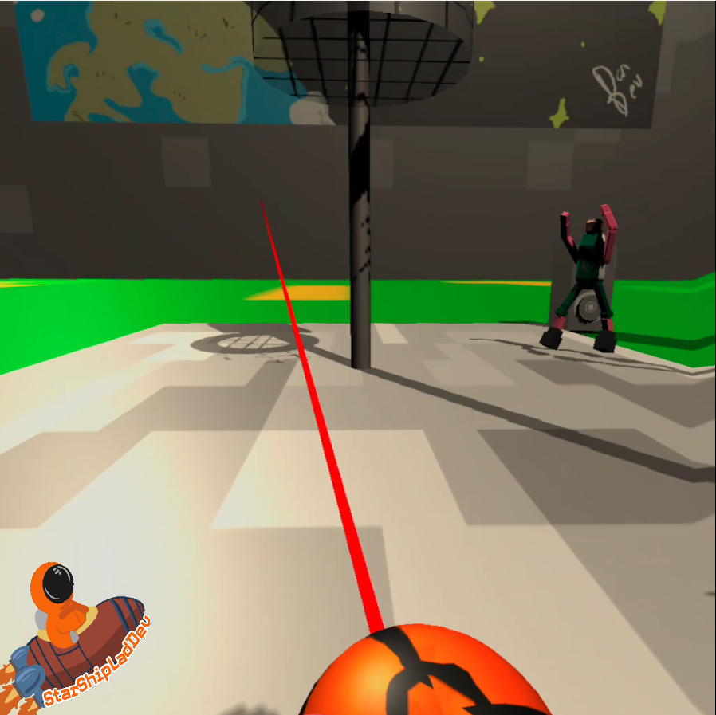
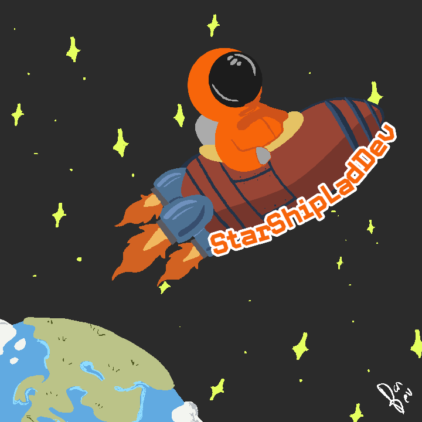

# BasketBall VR
Basketball VR is my attempt to create a basketball -simulation , while learning how to develop in a 3D environment, and the usage of XR- dev toolkits.

This app is designed to allow the feeling of casually shooting hoops and listening to music, as either someone locked in over the recent COVID crisis,
or someone unable to properly play due to medical reasons.

## Download exe & content here :  

Please be aware, desktop browsers open this .apk file in text format.

Installation instructions can be found here (Link live as of 22/11/2020) : 

## Latest  Build

0.1a - 22/11/2020 - Initial File Dump

## Latest Update
0.1a (Initial File Dump) - 22/11/2020
    > Added README
    > Add legacy animation character model imported from Blender to make oposition more realistic
    > Modify Speaker System handling to use 1 Audio source for all audio, so that songs can be stopped and new ones played mid-song
    > Add 2 New songs (Denzel Curry 'DIET' and Tech N9ne - Sickology 101) for personal enjoyment

## Next Update

0.2a (3-D Model update) Week ending 6/12/2020
 -> Update 3D models in-game
 -> Simple optimization steps
 -> Optimize basketball throwing physics

## Next Build
    *Title:* First Release
    *Summary:* A simple MVP basketball sim, with satisfying dribbling, shooting and point scoring.
    *Release date:* TBD

N/A
## View Of Latest Update:

## Playing Basketball VR

Your right hand has a 'catcher' line that you can grab the basketball with at any distance.Use the right controller trigger to activate this and grab the basketball.

Both hands have grab functions. Simply touch the ball with a hand and press the side-trigger on the controller touching the basketball. Let go of that trigger to release the ball.

Hitting the speaker with a ball will change the current song.

Opposition players will move quite close to you so watch out for accidental jump-scares! 

## Features(Planned In Brackets)

* Sound effects when the basketball interacts with objects (Net, backboard ect. ect.).

* Animated opposition characters.

* Music-playing speakers.

* Ball safety-measures ( The ball will always be grab-able ).

* ( Smooth FPS on a mobile oculus quest device. )

* ( Opposition players can steal ball and take shots. )

* ( Score system. )

* ( Title Page and proper UI. )

* ( Dribbling to move character.)

## Skill developing

I plan on this project improving my skills in the following:

> Customer interaction and feedback-actioning (I have asked several of my associates more knowledgeable in art direction, animation or basketball for regular feedback.)

> 3D model creation and character animation (Blender , FBX ).

> VR/ XR development toolkit knowledge.

>Social Media management and content creation.

!Developed by Starshiplad  

